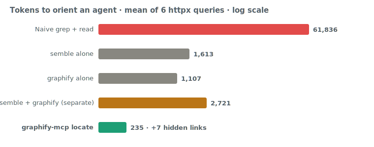
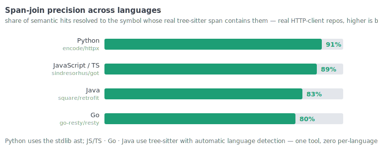

# graphify-mcp

[](https://github.com/yasinyaman/graphify-mcp/actions/workflows/ci.yml)
[](LICENSE)
[](https://www.python.org/)

A Python MCP server that exposes the [Graphify](https://graphify.net) knowledge graph as MCP tools, prompts and resources — so an AI assistant can explore your codebase through the graph during development, cheaply (token-budgeted) and structurally.

> Note: Graphify ships its own embedded MCP server (`graphify ./raw --mcp`). This project adds analysis tools, token-budgeted subgraph extraction, git freshness checks, per-community resources, reusable prompts, and LLM-friendly tool annotations + structured (JSON) output on top.

### Why `graphify_locate`

One MCP call turns a natural-language question into a **navigational map**, not a wall of code:

- 🔎 **Semantic + structural, one call** — semble finds the relevant code, the graph gives its neighborhood. ~235 tokens to orient vs ~61k for grep+read (**263× fewer** on httpx).
- 🔗 **`hidden_links`** — semantically similar code that is *structurally disconnected* (duplication / missing-abstraction / sync-async-twin candidates) that neither search nor the graph surfaces alone.
- 🌍 **Multi-language, zero config** — Python via stdlib `ast`; JS/TS · Go · Java · 165+ more via tree-sitter with automatic language detection. **Span-join precision holds at 80–91%** on real HTTP-client repos ([benchmark](#benchmark)).
- 🕒 **Cosmetic-aware freshness** — `graphify_freshness` ignores comment/format-only edits (in every language) so a reformat never triggers a needless rebuild.

## Installation

```bash
# graphify-mcp itself
pip install graphify-mcp

# plus the Graphify CLI it wraps (needed for build/query/path/explain/add)
pip install graphifyy && graphify install
```

From source:

```bash
git clone https://github.com/yasinyaman/graphify-mcp
cd graphify-mcp
pip install -e ".[dev]"
```

## Running

```bash
GRAPHIFY_PROJECT_DIR=/path/to/repo graphify-mcp-server
# equivalently, collision-proof:
GRAPHIFY_PROJECT_DIR=/path/to/repo python -m graphify_mcp
```

> **Heads-up:** `graphifyy` ships its own `graphify-mcp` console script (its
> embedded server), so if both packages are installed the bare `graphify-mcp`
> command resolves to whichever was installed last. Use `graphify-mcp-server`
> or `python -m graphify_mcp` to always launch *this* server.

### Claude Code

Copy `mcp.json` to a `.mcp.json` at your project root. `GRAPHIFY_PROJECT_DIR: "."` uses the project root.

### Claude Desktop / Cowork

Add the contents of `claude_desktop_config.json` to your Claude Desktop config:
- macOS: `~/Library/Application Support/Claude/claude_desktop_config.json`
- Windows: `%APPDATA%\Claude\claude_desktop_config.json`

### Transport (stdio default, optional HTTP)

stdio is the default and the right choice for a per-developer local server. To
serve over HTTP instead (e.g. a shared graph for a team or a web MCP client):

```bash
GRAPHIFY_TRANSPORT=streamable-http GRAPHIFY_HOST=127.0.0.1 GRAPHIFY_PORT=8000 \
  GRAPHIFY_PROJECT_DIR=/path/to/repo graphify-mcp-server
```

Any HTTP transport **force-enables path containment** (`GRAPHIFY_RESTRICT_PATHS`)
so a network client can't drive `graphify_build` to extract arbitrary filesystem
paths. HTTP binds `127.0.0.1` by default. To expose it beyond localhost, set
`GRAPHIFY_API_KEY` — every request must then send `Authorization: Bearer <key>`
(constant-time checked, 401 otherwise); binding a non-loopback host without a key
prints a warning.

```bash
GRAPHIFY_TRANSPORT=streamable-http GRAPHIFY_HOST=0.0.0.0 GRAPHIFY_API_KEY=$(openssl rand -hex 16) \
  GRAPHIFY_PROJECT_DIR=/path/to/repo graphify-mcp-server
```

For a smaller tool surface (helps some models pick the right tool), set
`GRAPHIFY_TOOLSET=lean` to expose only the core exploration tools.

## Environment variables

| Variable | Default | Description |
|---|---|---|
| `GRAPHIFY_PROJECT_DIR` | `.` | Project root to extract the graph from |
| `GRAPHIFY_OUT_DIR` | `graphify-out` | Output folder name |
| `GRAPHIFY_BIN` | `graphify` | CLI path |
| `GRAPHIFY_TIMEOUT` | `600` | CLI timeout (seconds) |
| `GRAPHIFY_RESTRICT_PATHS` | `0` | Confine `graphify_build`'s `path` to the project dir (auto-on for HTTP) |
| `GRAPHIFY_TRANSPORT` | `stdio` | `stdio` \| `streamable-http` \| `sse` |
| `GRAPHIFY_HOST` | `127.0.0.1` | Bind host for HTTP transports |
| `GRAPHIFY_PORT` | `8000` | Bind port for HTTP transports |
| `GRAPHIFY_API_KEY` | _(unset)_ | Require `Authorization: Bearer <key>` on HTTP transports |
| `GRAPHIFY_TOOLSET` | `full` | `full` \| `lean` (core exploration tools only) |

## Tools

CLI-backed (the first two write state; the rest are read-only):

| Tool | Purpose |
|---|---|
| `graphify_build` | Build/update the graph (`--update`, `--cluster-only`, `--mode deep`) |
| `graphify_add` | Add a source by URL (arXiv, tweet) |
| `graphify_query` | Natural-language query (`--dfs`, `--budget`) |
| `graphify_path` | Exact path between two nodes |
| `graphify_explain` | Everything about a node |

graph.json analysis (read-only, no CLI needed, `as_json=True` for structured output):

| Tool | Purpose |
|---|---|
| `graphify_overview` | **Call first** — size, god nodes, communities, surprises, suggested next steps |
| `graphify_god_nodes` | Most connected nodes |
| `graphify_communities` | Leiden community summaries |
| `graphify_surprises` | Unexpected cross-domain connections |
| `graphify_search` | Node search |
| `graphify_neighbors` | 1-hop neighbors of a node |
| `graphify_subgraph` | **Token-budgeted** BFS subgraph around a node — the cheap way to feed the model just the relevant slice |
| `graphify_node_details` | Node metadata: type, source file/line, docstring, community |
| `graphify_freshness` | Is the graph stale vs. git HEAD? Returns `recommended_action` (fresh/update/rebuild) + `reason` — deletions/large changes steer to a full rebuild |
| `graphify_validate` | Lint the graph for dangling/duplicate/self-loop edges and orphan nodes (read-only) |

Semantic naming (uses the **host model via MCP sampling** — no API key — or a backend key):

| Tool | Purpose |
|---|---|
| `graphify_sampling_status` | Capability test: reports whether the client supports host-LLM sampling, whether a backend key is set, and which method will be used |
| `graphify_label_communities` | Give Leiden communities human-readable names. `method="auto"` (sampling → key → placeholder), `"sampling"`, `"cli"`, or `"placeholder"` |
| `graphify_set_labels` | Persist **assistant-provided** community names (sampling-free fallback) to `.graphify_labels.json` and patch them into `graph.html` |

Semantic bridge (optional `[semble]` extra — semantic search joined to graph structure):

| Tool | Purpose |
|---|---|
| `graphify_locate` | NL query → enclosing graph node → token-budgeted subgraph, **plus `hidden_links`**: semantically-similar code that is structurally disconnected (duplication / missing-abstraction candidates) |

## Naming communities without an API key (MCP sampling)

The Leiden clustering is keyless, but turning `Community 7` into `Authentication`
needs a model. Three ways, in `graphify_label_communities`'s preference order:

1. **Host-LLM sampling** — the server asks the *connected client* to run the
   completion via MCP `sampling/createMessage`. The model the user already uses
   (e.g. Claude in a sampling-capable client) does the naming; **the server holds
   no API key**. Subject to client support — call `graphify_sampling_status`
   first; it degrades gracefully when unsupported.
2. **Backend API key** (`method="cli"`) — set `GEMINI_API_KEY` / `OPENAI_API_KEY`
   / `ANTHROPIC_API_KEY` / … (or run a local **ollama**) and graphify's own
   backend names them. This option always remains available.
3. **Placeholders** — no model anywhere: names stay `Community N`.

If the client can't sample and you have no backend (e.g. **Claude Code**, which
doesn't support sampling), use the **assistant-driven fallback**: the assistant
is already a capable model in the loop, so it reads `graphify_communities` and
pushes names back via **`graphify_set_labels({"0": "Authentication", ...})`** —
no key, no sampling, works in any client. The names persist to
`.graphify_labels.json` and are patched into `graph.html`.

## Semantic bridge (optional `[semble]`)

`pip install "graphify-mcp[semble]"` adds `graphify_locate`, which joins
[semble](https://github.com/MinishLab/semble)'s semantic code search to the graph
in one call. Graphify gives **structure** (how code connects); semble gives
**retrieval** (which code is semantically relevant) — they're complementary.

`graphify_locate("how does retry backoff work")`:
1. semble finds the most relevant code and resolves the top hit to its enclosing
   graph node (better than label matching).
2. returns the token-budgeted subgraph around it (**structure**).
3. runs semble `find_related` and cross-checks: a cousin that is semantically
   similar but **not** within the seed's structural neighborhood is flagged as a
   `hidden_link` (with its hop distance) — a duplication / missing-abstraction /
   implicit-coupling candidate that neither tool surfaces alone.

The extra is optional: without it the core tools are unchanged and `graphify_locate`
returns an install hint. It also pairs well with running semble's own MCP server
alongside graphify-mcp.

The chunk→node join and the freshness cosmetic-vs-structural check work
**across languages**: Python uses the stdlib `ast` (no extra deps), and every
other language (JS/TS, Go, Rust, Java, Ruby, C/C++, …) is handled by an optional
**tree-sitter** backend — `pip install "graphify-mcp[treesitter]"`, also pulled in
by graphify. Without it, non-Python files fall back to nearest-line matching.

## Benchmark

Averaged over **6 queries** spanning httpx subsystems (send path, digest auth,
redirects, content decoding, cookies, timeouts) on the 2,101-node graph. Each query
orients an agent to a code area; *tokens* = what reaches the model's context
(≈ chars/4).



| Approach | Tokens (avg) | Calls | Structure | Semantic | Hidden links |
|---|---|---|---|---|---|
| Naive grep + read | 61,836 | ~14 | — | — | 0 |
| semble alone | 1,613 | 1 | — | ✓ | 0 |
| graphify alone | 1,107 | 1 | ✓ | — | 0 |
| semble + graphify (separately) | 2,721 | 4 | ✓ | ✓ | 0 |
| **`graphify_locate`** | **235** | **1** | ✓ | ✓ | **7** |

`graphify_locate` averages **263× fewer tokens than grep+read** and **11.6× fewer
than running semble and graphify separately** (one call instead of four) — and it's
the only approach that surfaces `hidden_links` (semantically similar but structurally
disconnected code), 5–10 per query.

Those ~235 tokens are a navigational *map* (seed `file:line` + structural
neighborhood + hidden links), not raw code — you fetch the specific code only where
needed. That's the trade graphify-mcp optimizes: cheapest orientation plus the
cross-check signal, then drill in precisely.

**Case study — the hidden links are real.** Asked *"does httpx duplicate
request-sending across sync and async?"*, `graphify_locate` returned the seed
`Client._send_single_request` and flagged hidden links. Checking the source
confirmed every production flag is a genuine sync/async twin:
`Client._send_single_request` (`_client.py:1001`) ↔ `AsyncClient._send_single_request`
(`:1717`); `BaseTransport.handle_request` ↔ `handle_async_request` (in every
transport); `__enter__` ↔ `__aenter__`. ~500 tokens (one `locate` + a targeted read)
surfaced a real architectural pattern that naively reading `_client.py` (~16k tokens)
would. The `unreachable` bucket also held test files (related, not refactor targets) —
the `distance` field separates production parallels (3–4) from that noise.

**Across languages — real HTTP-client repos.** The span join and freshness check aren't
Python-only. I built AST-only graphs for an HTTP client in three more languages and ran the
same kind of queries (send · redirects · timeout/retry · headers/auth · transport):



| Language | Repo | Span-join precision | Qualname | Hidden / q | locate vs grep |
|---|---|---|---|---|---|
| **Python** (ast) | `encode/httpx` | **91%** (49/54) | 67% | 4.0 | 232× |
| JavaScript / TS | `sindresorhus/got` | 85% (46/54) | 50% | 3.2 | 480× |
| Go | `go-resty/resty` | 80% (43/54) | 67% | 4.7 | 757× |
| Java | `square/retrofit` | 83% (45/54) | 50% | 5.5 | 208× |

Python uses the stdlib `ast`; JS/TS · Go · Java go through tree-sitter with automatic language
detection — **one tool, zero per-language config**. *Span-join precision* = share of semantic
hits whose resolved node's real span actually contains the chunk. It holds at **80–91%** across
380–2,101-node graphs, hidden-links keep surfacing 3–6/query, and locate stays **200–750×
cheaper** than grep+read. `graphify_freshness`'s cosmetic-vs-structural check is correct in
every language too (comment/reformat → cosmetic; operator/rename → structural). Reproduce with
[`benchmarks/multilang.py`](benchmarks/multilang.py).

→ **[Full benchmark report](https://htmlpreview.github.io/?https://github.com/yasinyaman/graphify-mcp/blob/master/docs/benchmark.html)** (interactive HTML, per-query breakdown + the cross-language tables) — or open [`docs/benchmark.html`](docs/benchmark.html) locally. ([Türkçe](https://htmlpreview.github.io/?https://github.com/yasinyaman/graphify-mcp/blob/master/docs/benchmark.tr.html))

<sub>Measured 2026-06 with semble 0.3.4 + graphify (tree-sitter backend). httpx headline = 6
queries (per-query locate 189–286 tokens); cross-language = 6 queries × 54 hits each on
`got` / `resty` / `retrofit`. Numbers vary by codebase and query.</sub>

## Resources

- `graphify://report` — GRAPH_REPORT.md
- `graphify://graph` — graph.json (raw)
- `graphify://community/{id}` — per-community wiki (members + internal/boundary edges)

## Prompts

Reusable templates that orchestrate the tools for the assistant:

- `onboard` — orient to the codebase (overview → communities → subgraphs → surprises → summary)
- `trace_bug(symptom)` — find likely root-cause locations through the graph
- `explain_flow(flow)` — end-to-end walkthrough of a named flow with file:line refs

## LLM-friendliness

- **Tool annotations** (`readOnlyHint`, `destructiveHint`, titles) tell the model which tools are safe to call freely vs. which mutate state.
- **Server instructions** describe the recommended flow (overview → targeted subgraph/query → build update).
- **`as_json` output** on every analysis tool returns structured data the model can chain on instead of re-parsing prose.
- **Token budgeting** (`graphify_subgraph`) keeps context small on large graphs — the core of Graphify's ~71× compression.
- **Host-LLM sampling** (`graphify_label_communities`) lets the server borrow the client's model via MCP `sampling/createMessage`, so semantic naming works with no server-side API key — with a capability test (`graphify_sampling_status`) and a backend-key fallback.

## Typical workflow

1. `graphify_overview()` — orientation
2. `graphify_communities()` — subsystems
3. `graphify_subgraph("SomeNode")` — token-cheap targeted exploration
4. `graphify_query("how does the auth flow work?")` — questions
5. After code changes: `graphify_freshness()` → `graphify_build(".", update=True)`

## Project layout

```
graphify-mcp/
├── src/graphify_mcp/      # package (server.py, __init__.py)
├── tests/                 # pytest suite + fixture graph.json
├── .github/workflows/     # CI (ruff + pytest, py 3.10–3.12)
├── pyproject.toml         # packaging + console script
├── mcp.json               # Claude Code example config
└── claude_desktop_config.json
```

## Development

```bash
pip install -e ".[dev]"
ruff check .
pytest -q
```

See [CONTRIBUTING.md](CONTRIBUTING.md). Licensed under [MIT](LICENSE).
